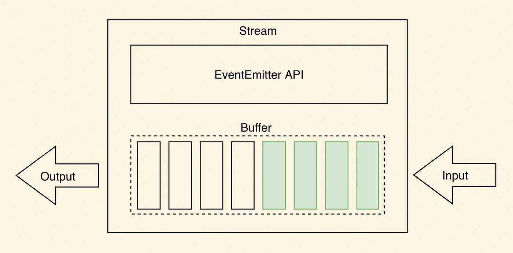
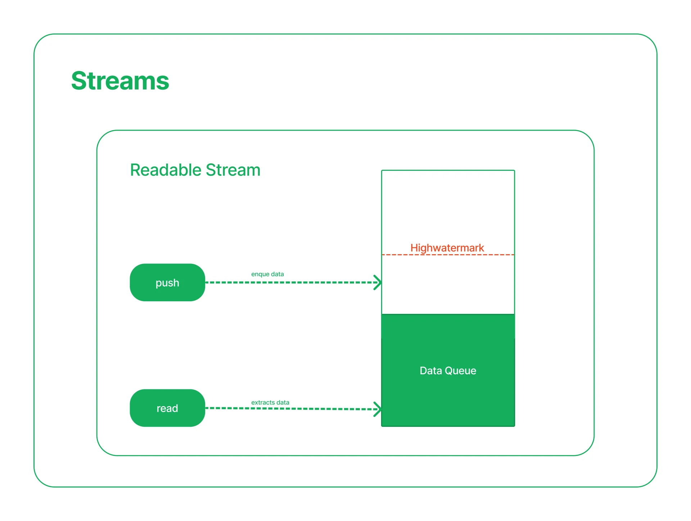
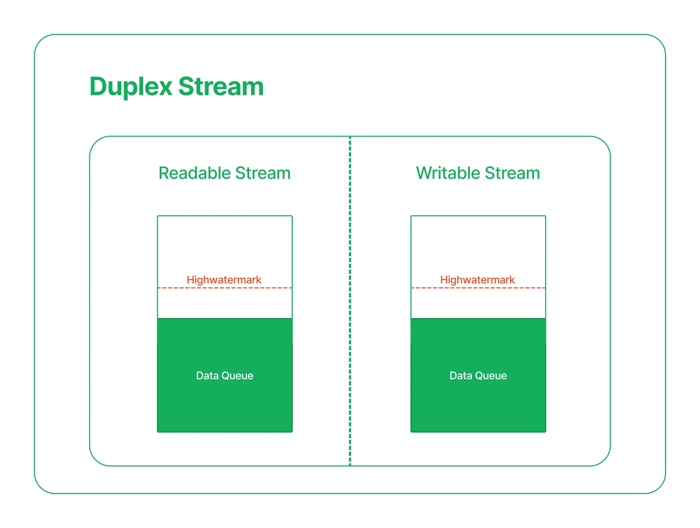

# Nodejs 中的流（Streams）

在计算机科学中，流（Stream）是一种处理数据的方式，它允许我们将数据看作是持续不断的序列，而不是一次性全部加载到内存中的完整集合。

在构建较复杂的系统时，通常将其拆解为功能独立的若干部分。这些部分的接口遵循一定的规范，通过某种方式相连，以共同完成较复杂的任务。譬如，Shell 通过管道 `|` 连接各部分，其输入输出的规范是文本流，在 Node.js 中，内置的 `stream` 模块也实现了类似功能，各部分通过 `.pipe()` 连接。

> Shell 中的管道（pipe）是一种特殊的操作符 `|`，它用于将一个命令的输出连接到另一个命令的输入，从而实现两个或多个命令之间的数据传输。

## 流的应用

在 Node.js 中，流机制扮演着至关重要的角色，特别是在处理大文件、实时数据流、网络通信等领域，它能有效地节省内存资源，提高应用程序性能。以下是 Node.js 流的一些典型应用：

1. 文件操作：

   - 读取大文件时，使用 `fs.createReadStream()` 创建可读流，能够逐块读取文件内容，避免一次性加载整个文件到内存中，减少内存占用。
   - 写入大文件时，使用 `fs.createWriteStream()` 创建可写流，可以持续不断地写入数据，同样避免一次性写入大量数据造成内存压力。

2. 网络通信：

   - HTTP 请求和响应：在客户端和服务器端，HTTP 请求和响应都可以被视作流。客户端可以创建可写流来发送请求体，服务端可以创建可读流来接收请求体；反之，服务端可以创建可写流来发送响应体，客户端可以创建可读流来接收响应体。

3. 数据压缩与解压：

   - 使用 zlib 模块，可以创建转换流对数据进行压缩（如 gzip）或解压缩，数据在流动过程中会被自动处理。

4. 数据流处理管道：

   - 多个流可以通过 `.pipe()` 方法串联起来形成一个管道，一个流的输出作为另一个流的输入，实现数据的连续处理。例如，先读取文件，接着压缩，然后加密，最后上传到远程服务器，整个过程可以构建一条高效的流处理链路。

> [🔗 示例代码](https://github.com/qiuxchao/node-stream-demo/tree/main/part-1)

## 流的基本使用

Node.js 中的流可以分为四种类型：可读流（Readable）、可写流（Writable）、双工流（Duplex）和转换流（Transform）。每种类型都有其特定的用途和功能。

```js
const Stream = require("stream");

const Readable = Stream.Readable;
const Writable = Stream.Writable;
const Duplex = Stream.Duplex;
const Transform = Stream.Transform;
```

### 可读流（Readable Streams）

可读流用于读取数据。它提供一个接口来从数据源（如文件、网络请求等）读取数据。可以通过监听可读流的 `'data'` 事件来处理每次接收到的数据块。

#### 创建可读流

有多种方式可以创建可读流，例如 `fs.createReadStream()`、`Readable.from()` 等。下面将介绍从 `Readable` 类创建自定义可读流的方法，这种方法需要继承 `Readable` 类，并实现 `_read` 方法。

- `_read` 方法是从底层系统读取具体数据的逻辑，即生产数据的逻辑。
- 在 `_read` 方法中，通过调用 `push(data)` 将数据放入可读流中供下游消耗。
- 在 `_read` 方法中，可以同步调用 `push(data)`，也可以异步调用。
- 当全部数据都生产出来后，必须调用 `push(null)` 来结束可读流。
- 流一旦结束，便不能再调用 `push(data)` 添加数据。

可以通过监听 `'data'` 事件的方式消耗可读流。

- 在首次监听其 `'data'` 事件后，`readable` 便会持续不断地调用 `_read()`，通过触发 `'data'` 事件将数据输出。
- 第一次 `'data'` 事件会在下一个事件循环 tick 中触发，所以，可以安全地将数据输出前的逻辑放在事件监听后。
- 当数据全部被消耗时，会触发 `'end'` 事件。

```js
const { Readable } = require("stream");

// 创建可读流
class ToReadable extends Readable {
  // 接收一个迭代器
  constructor(iterator) {
    super();
    this.iterator = iterator;
  }

  // 子类需要实现该方法
  // 这是生产数据的逻辑
  _read() {
    const res = this.iterator.next();
    if (res.done) {
      // 数据源已枯竭，调用 `push(null)` 通知流
      return this.push(null);
    }
    // 通过 `push` 方法将数据添加到流中
    this.push(res.value + "\n");
  }
}

function* generator() {
  let i = 0;
  while (i < 10) {
    yield i++;
  }
}

const iterator = generator();

const readable = new ToReadable(iterator);

// 监听`data`事件，一次获取一个数据
readable.on("data", (data) => {
  // 将数据写入到标准输出流
  process.stdout.write(data);
});

readable.on("end", () => {
  process.stdout.write("DONE");
});
```

> [🔗 示例代码](https://github.com/qiuxchao/node-stream-demo/tree/main/part-2/Readable.js)

#### 消费可读流

有多种方式可以消费可读流：

1. 监听 `'data'` 事件：每当可读流有新的数据块可用时，会触发 `'data'` 事件。可以通过监听此事件并提供回调函数来逐块处理数据。

```js
const readableStream = getReadableStreamSomehow();
readableStream.on("data", (chunk) => {
  // `chunk` 是一个 Buffer 或字符串对象，具体类型取决于流的编码格式
  // 对 chunk 进行处理，例如写入到文件或发送至网络
  processChunk(chunk);
});
```

2. 使用 `read()` 方法：手动调用 `.read()` 方法以按需获取数据块，这种方式较少见且需要管理内部缓冲区。

```js
const readableStream = getReadableStreamSomehow();
// 使用 `readable` 事件监听器，当数据块可用时触发
readableStream.on("readable", () => {
  // 在每次数据块可用时，读取数据块
  const chunk = readableStream.read();
  chunk && console.log(chunk.toString());
});
```

3. 管道：通过 `stream.pipe()` 方法将可读流连接到可写流，这样可读流产生的数据会被自动传输给可写流，无需关心数据分块和错误处理细节。

```js
const sourceStream = fs.createReadStream("input.txt");
const destinationStream = fs.createWriteStream("output.txt");
sourceStream.pipe(destinationStream);
```

#### 两种模式

可读流有两种主要的读取模式：流动模式（Flowing Mode）和暂停模式（Paused Mode）。

1. 流动模式（Flowing Mode）： 在流动模式下，可读流会自动推送数据到下游。一旦可读流开始流动，它会持续地触发 `'data'` 事件，直到数据流结束，触发 `'end'` 事件。流动模式可以通过以下方式启动：

    - 监听 `'data'` 事件。
    - 调用 `resume()` 方法。
    - 将可读流连接到可写流，使用 `pipe()` 方法。

2. 暂停模式（Paused Mode）： 在暂停模式下，可读流不会自动推送数据，除非显式调用 `read()` 方法来读取数据。暂停模式可以通过以下方式启用：

    - 调用 `pause()` 方法。
    - 不监听 `'data'` 事件。

#### 三种状态

可读流 "两种模式" 的概念是对其实现过程中发生的更复杂的内部状态管理的简化抽象。具体来说，在任何给定的时间点，每个可读流都处于三种可能的状态之一，`readable.readableFlowing` 属性反映了流当前的流动状态，下面是三种状态的取值和含义：

- `null`（未知或未初始化）： 当 `readable.readableFlowing` 的值为 `null` 时，说明当前流的状态还没有初始化或处在不确定状态。在流实例刚创建后或重置状态下，`readableFlowing` 可能会是 `null`，随后通过调用相关方法改变流的行为后，该属性的值将变为 `true` 或 `false`。

- `true`（流动模式）： 当 `readable.readableFlowing` 的值为 `true` 时，表明可读流处于流动模式（Flowing Mode）。在这种模式下，可读流会自动推送数据给消费者。当有数据可读时，流会触发 `'data'` 事件，当数据全部读取完毕时触发 `'end'` 事件。流动模式可以通过监听 `'data'` 事件、调用 `resume()` 方法或使用 `pipe()` 方法连接到可写流来启动。

- `false`（暂停模式）： 当 `readable.readableFlowing` 的值为 `false` 时，表明可读流处于暂停模式（Paused Mode）。此时，流不会自动推送数据，需要通过调用 `read()` 方法手动读取数据。在暂停模式下，开发者需要手动管理数据读取的频率和节奏，以避免潜在的背压问题。

> [🔗 示例代码](https://github.com/qiuxchao/node-stream-demo/tree/main/part-2/AsyncReadable.js)


### 可写流（Writable Streams）

可写流用于写入数据。它提供一个接口来将数据写入目标（如文件、网络请求等）。

- 上游通过调用 `writable.write(data)` 将数据写入可写流中。`write()` 方法会调用 `_write()` 将 data 写入底层。
- 在 `_write` 中，当数据成功写入底层后，必须调用 `next(err)` 告诉流开始处理下一个数据。
- `next` 的调用既可以是同步的，也可以是异步的。
- 上游必须调用 `writable.end(data)` 来结束可写流，data 是可选的。此后，不能再调用 `write` 新增数据。
- 在 `end` 方法调用后，当所有底层的写操作均完成时，会触发 `'finish'` 事件。

```js
const { Writable } = require("stream");
const { writeFileSync } = require("fs");
const { resolve } = require("path");

const writable = new Writable();

// 实现 `_write` 方法
// 这是将数据写入底层的逻辑
writable._write = function (chunk, encoding, next) {
  // 将流中的数据写入底层
  process.stdout.write(chunk.toString().toUpperCase());
  writeFileSync(
    resolve(__dirname, "./writeable-test.txt"),
    chunk.toString().toUpperCase(),
    {
      encoding: "utf8",
      // 追加模式
      flag: "a",
    }
  );
  // 写入完成时，调用 `next()` 方法通知流传入下一个数据
  process.nextTick(next);
};

// 所有数据均已写入底层
writable.on("finish", () => process.stdout.write("数据写入完成"));

// 将一个个数据写入流中
writable.write("a" + "\n");
writable.write("b" + "\n");
writable.write("c" + "\n");

// 再无数据写入流时，调用 `end()` 方法结束流
writable.end();
```

> [🔗 示例代码](https://github.com/qiuxchao/node-stream-demo/tree/main/part-2/Writable.js)

### 双工流（Duplex Streams）

双工流是同时可读和可写的流。它们既能读取数据，也能写入数据。例如，WebSocket 就是一种双工流。可以通过创建自定义的双工流来实现特定的需求。

`Duplex` 实际上就是继承了 `Readable` 和 `Writable` 的一类流。 所以，一个 `Duplex` 对象既可当成可读流来使用（需要实现 `_read` 方法），也可当成可写流来使用（需要实现 `_write` 方法）。

```js
const { Duplex } = require("stream");

const duplex = new Duplex();

// 可读端底层逻辑
duplex._read = function () {
  this._readNum = this._readNum || 0;
  if (this._readNum > 1) {
    this.push(null);
  } else {
    this.push("" + this._readNum++);
  }
};

// 可写端底层逻辑
duplex._write = function (chunk, encoding, next) {
  console.log("write data: " + chunk.toString());
  next();
};

// 0, 1
duplex.on("data", (data) => console.log(`read data: ${data}`));

duplex.write("a");
duplex.write("b");
duplex.end();
```

上面的代码中实现了 `_read` 方法，所以可以监听 `data` 事件来消耗 `Duplex` 产生的数据。 同时，又实现了 `_write` 方法，可作为下游去消耗数据。

因为它既可读又可写，所以称它有两端：可写端和可读端。 可写端的接口与 `Writable` 一致，作为下游来使用；可读端的接口与 `Readable` 一致，作为上游来使用。

> [🔗 示例代码](https://github.com/qiuxchao/node-stream-demo/tree/main/part-2/Duplex.js)

### 转换流（Transform Streams）

在上面的例子中，可读流中的数据（0, 1）与可写流中的数据（'a', 'b'）是隔离开的，但在 `Transform` 中可写端写入的数据经变换后会自动添加到可读端。 `Transform` 继承自 `Duplex`，并已经实现了 `_read` 和 `_write` 方法，同时要求用户实现一个 `_transform` 方法。

```js
const { Transform } = require("stream");

const transform = new Transform();

// 将写入的数据转换为大写
transform._transform = function (chunk, encoding, next) {
  const res = chunk.toString().toUpperCase();
  this.push(res);
  next();
};

transform.on("data", (data) => console.log(data.toString()));

transform.write("a");
transform.write("b");
transform.write("c");
transform.end();

// A
// B
// C
```

> [🔗 示例代码](https://github.com/qiuxchao/node-stream-demo/tree/main/part-2/Transform.js)

### 对象模式（Object Mode）

在上面的例子中，经常看到调用 `data.toString()`。这是因为可读流和可写流默认情况下都是以 `Buffer` 类型来传输数据的，如果我们不调用 `.toString()`，则会看到如下输出：

```bash
<Buffer 61>
<Buffer 62>
```

不过，每个构造函数都接收一个配置对象，其中有一个 `objectMode` 的选项，一旦设置为 `true`，数据会被解析为 JavaScript 对象，而不是 Buffer 对象。

```js
const { Transform } = require("stream");

const transform = new Transform({
  // 使用对象模式
  objectMode: true,
});

// 将写入的数据转换为大写
transform._transform = function (chunk, encoding, next) {
  // 不再需要 .toString()
  const res = chunk.toUpperCase();
  this.push(res);
  next();
};

transform.on("data", (data) => {
  // 不再需要 .toString()
  console.log(data);
});

transform.write("a");
transform.write("b");
transform.write("c");
transform.end();

// A
// B
// C
```

> [🔗 示例代码](https://github.com/qiuxchao/node-stream-demo/tree/main/part-2/objectMode.js)

### 缓冲（Buffer）

可读流和可写流都将数据存储在内部缓冲区（Buffer）中。



- 缓冲区的数据量取决于传给流的构造函数的 `highWaterMark` 选项。对于普通流，`highWaterMark` 选项指定总字节数（默认为 16384 个字节=16KB）。对于在对象模式下操作的流，`highWaterMark` 指定对象的总数（默认为 16 个对象）。

- 当调用 `readable.push(chunk)` 时，数据缓存在可读流中。如果流的消费者（例如通过监听 `'data'` 事件或者调用 `readable.read()` 方法）没有及时处理这些数据，则数据会一直驻留在缓存队列中，直到被消费。

- 一旦内部读取缓冲区的总大小达到 `highWaterMark` 指定的阈值，则流将暂时停止从底层资源读取数据，直到可以消费当前缓冲的数据（也就是，流将停止调用内部的用于填充读取缓冲区 `readable._read()` 方法）。



- 当重复调用 `writable.write(chunk)` 方法时，数据会缓存在可写流中。当内部的写入缓冲区的总大小低于 `highWaterMark` 设置的阈值时，但对 `writable.write()` 的调用将返回 `true`。一旦内部缓冲区的大小达到或超过 `highWaterMark`，则将返回 `false`。

- `highWaterMark` 选项是一个阈值，而不是限制：它规定了流在停止请求更多数据之前缓冲的数据量。它通常不强制执行严格的内存限制。特定的流实现可能会选择实现更严格的限制，但这样做是可选的。

- 因为 `Duplex` 和 `Transform` 流都是 `Readable` 和 `Writable`，所以每个都维护两个独立的内部缓冲区，用于读取和写入，允许每一方独立于另一方操作，同时保持适当和高效的数据流。



> [🔗 示例代码](https://github.com/qiuxchao/node-stream-demo/tree/main/part-2/Buffering.js)

### 背压（Backpressure）

背压（Backpressure）是指在数据流动的过程中，当可写流无法及时处理可读流（Readable Stream）传递的数据，导致数据在可写流中堆积的现象。

处理背压的主要目的是确保数据在可读流和可写流之间保持平衡，避免数据积压过多而导致内存溢出或系统资源耗尽。

可以通过监测可写流的缓冲区是否已满，来决定是否需要暂停可读流的读取操作，从而实现动态调整可读流的读取速度来避免数据积压。

- 当可写流的缓冲区已满时（`writable.write() === false`），暂停可读流的读取操作。
- 当可写流的缓冲区有剩余空间时（触发 `'drain'` 事件），再继续读取数据。

```js
const { Readable, Writable } = require("stream");

const readable = new Readable({
  highWaterMark: 1,
  read() {
    if (this.count === undefined) {
      this.count = 0;
    }
    if (this.count < 10) {
      this.push(`${this.count++}`);
    } else {
      this.push(null);
    }
  },
});

const writeable = new Writable({
  highWaterMark: 1,
  write(chunk, encoding, next) {
    // 模拟写入操作很慢，仅每秒处理1个字符
    setTimeout(() => {
      console.log(`写入${chunk}（读写流缓冲大小：${readable.readableLength} ${writeable.writableLength})`);
      next();
    }, 1000);
  },
});

writeable.on("finish", () => {
  console.log("所有数据已写入完毕");
});

// 不处理背压，会导致数据堆积在可写流的缓冲区中，占用内存
// readable.on("data", (data) => {
//   writeable.write(data);
// });
// readable.on("end", () => {
//   writeable.end();
// });

// 递归读写数据，自行处理背压，解决数据堆积问题
const run = () => {
  const chunk = readable.read(1);
  if (chunk !== null) {
    const canWrite = writeable.write(chunk);
    if (!canWrite) {
      // 背压 不能继续写入
      // 暂停可读流直到可写流 drain 事件触发
      readable.pause();
      writeable.once("drain", () => {
        // 可写流 写入缓冲区已清空，可继续读取可读流
        readable.resume();
        run();
      });
    }
  } else {
    writeable.end();
  }
};
run();

// 使用 pipe 自动处理背压
// readable.pipe(writeable);
```

以上示例代码，只是为了解释背压产生的原因。实际开发中，应该使用 Stream API 中内置的 `pipe()` 方法自动处理背压，而不是自己手动处理。

> [🔗 示例代码](https://github.com/qiuxchao/node-stream-demo/tree/main/part-2/Backpressure.js)

### 管道（Pipeline）

`pipe()` 方法是可读流（Readable Stream）的一个实例方法，用于将可读流连接到可写流（Writable Stream）以实现数据的自动传输。通过 `pipe()` 方法将多个流链接起来，形成一个数据处理流水线，使得数据可以从一个流无缝流动到另一个流。

```js
readableStream.pipe(writableStream, [options]);
```

使用 `pipe()` 方法时，它会自动处理数据传输，并处理背压（Backpressure）以确保数据流平衡。

```js
const { Readable, Writable } = require("stream");

class MyReadable extends Readable {
  constructor(max) {
    super({
      objectMode: true,
    });
    this.max = max;
    this.count = 0;
  }

  _read() {
    if (this.count < this.max) {
      this.push(this.count++);
    } else {
      this.push(null);
    }
  }
}

class MyWritable extends Writable {
  constructor() {
    super({
      objectMode: true,
    });
  }

  _write(chunk, encoding, next) {
    console.log(chunk.toString());
    next();
  }
}

const readable = new MyReadable(10);
const writable = new MyWritable();
readable.pipe(writable);
```

> [🔗 示例代码](https://github.com/qiuxchao/node-stream-demo/tree/main/part-2/pipe.js)

## 编写流式程序

### 示例1：CSS样式生成器。

```ts
import { Readable, Transform } from "stream";

class Style extends Readable {
  style: { [key: string]: any };

  constructor() {
    super({ objectMode: true });
    this.style = {};
  }

  _read() {
    this.push(JSON.stringify(this.style));
    this.push(null);
  }
}

type ColorType = "red" | "green" | "blue" | (string & {});

class Color extends Transform {
  color: ColorType;

  constructor(color: ColorType) {
    super({ objectMode: true });
    this.color = color || "red";
  }

  _transform(style, encoding, callback) {
    callback(null, JSON.stringify({ ...JSON.parse(style), color: this.color }));
  }
}

type TextAlignType = "left" | "center" | "right";

class TextAlign extends Transform {
  textAlign: TextAlignType;

  constructor(textAlign: TextAlignType) {
    super({ objectMode: true });
    this.textAlign = textAlign || "left";
  }

  _transform(style, encoding, callback) {
    callback(
      null,
      JSON.stringify({ ...JSON.parse(style), textAlign: this.textAlign })
    );
  }
}

type BackgroundType = "blue" | "black" | "white" | (string & {});

class Background extends Transform {
  background: BackgroundType;

  constructor(background: BackgroundType) {
    super({ objectMode: true });
    this.background = background || "left";
  }

  _transform(style, encoding, callback) {
    callback(
      null,
      JSON.stringify({ ...JSON.parse(style), background: this.background })
    );
  }
}

const style = new Style();

style
  .pipe(new Color("blue"))
  .pipe(new TextAlign("right"))
  .pipe(new Background("#f5f5f5"))
  .pipe(process.stdout);

// {"color":"blue","textAlign":"right","background":"#f5f5f5"}
```

> [🔗 示例代码](https://github.com/qiuxchao/node-stream-demo/tree/main/part-3/cssStyle.js)

### 示例2：断点续传

服务端：

```ts
import { createServer } from "http";
import { resolve } from "path";
import { createWriteStream, statSync } from "fs";

const savePath = resolve(__dirname, "output.txt");

createServer((req, res) => {
  console.log(req.url);

  // 创建写入流，用于写入文件
  const fileStream = createWriteStream(savePath, { flags: "a" });

  // 获取已经接收到的文件大小
  let len = statSync(savePath).size;

  // 获取已上传的文件大小接口
  if (req.url?.includes("getLen")) {
    res.end(len.toString());
    return;
  }

  req.pipe(fileStream).on("finish", () => {
    res.end("ok");
  });
}).listen(6677);
```

客户端：

```ts
import { request } from "http";
import { resolve } from "path";
import { createReadStream } from "fs";

const inputPath = resolve(__dirname, "input.txt");

const options = {
  hostname: "localhost",
  port: 6677,
};

// 获取已上传的长度
const getLen = (): Promise<number> => {
  return new Promise((resolve, reject) => {
    const req = request(
      {
        ...options,
        path: "/getLen",
      },
      (res) => {
        // 处理响应
        let responseData = "";
        res.on("data", (chunk) => {
          responseData += chunk;
        });
        res.on("end", () => {
          resolve(Number(responseData));
        });
      }
    );
    // 处理错误
    req.on("error", reject);
    // 发送请求
    req.end();
  });
};

// 上传没传过的部分
const upload = (finishedLen: number) => {
  const readableStream = createReadStream(inputPath, {
    start: finishedLen,
  });
  return new Promise((resolve, reject) => {
    // 创建请求 req 是一个可写流
    const req = request({
      ...options,
      method: "POST",
    });
    // 处理错误
    req.on("error", reject);
    readableStream.pipe(req).on("finish", resolve);
  });
};

(async () => {
  const len = await getLen();
  console.log("已上传：", len);
  await upload(len);
  console.log("上传完成");
})();
```

> [🔗 示例代码](https://github.com/qiuxchao/node-stream-demo/tree/main/part-3/pointUpload)

> 本文参考：<br/>
> [流 - Node.js 中文文档](https://nodejs.cn/api/stream.html) <br/>
> [流 - Node Guidebook](https://tsejx.github.io/node-guidebook/system/io/stream) <br/>
> [Node.js Stream - 基础篇](https://tech.meituan.com/2016/07/08/stream-basics.html)